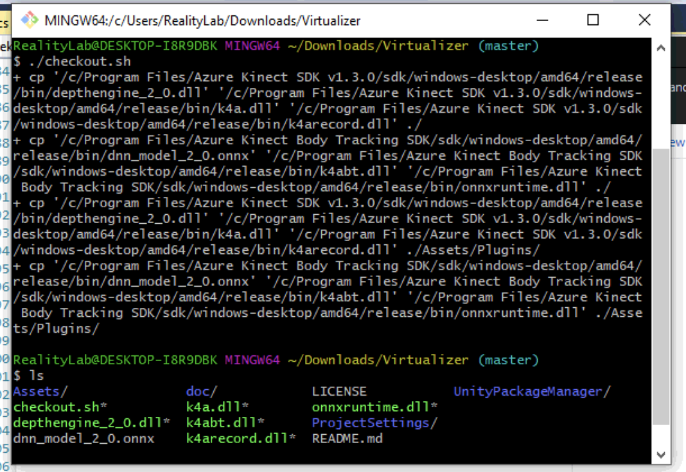
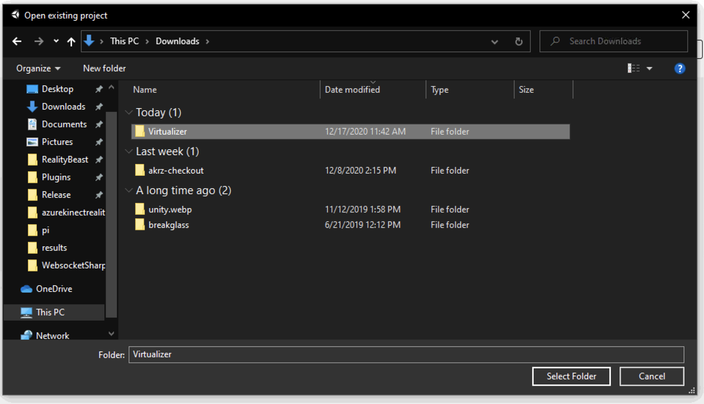
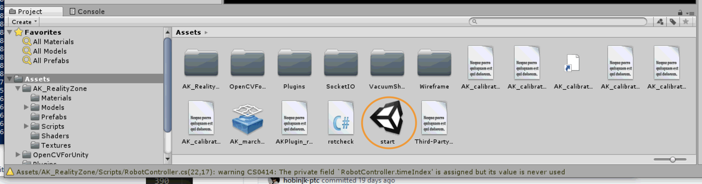
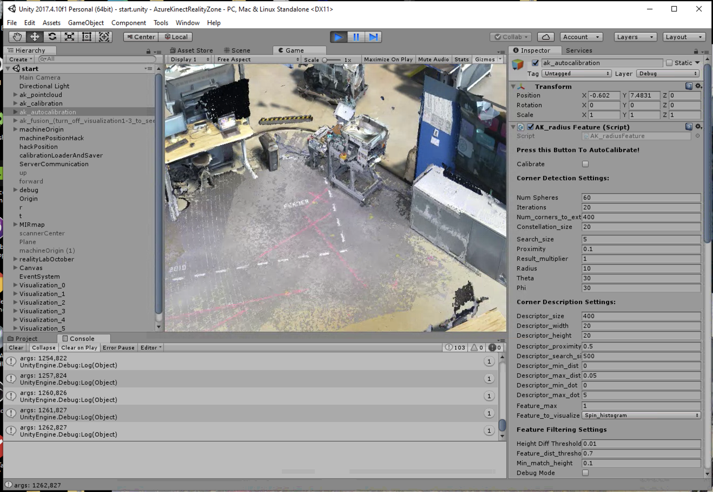
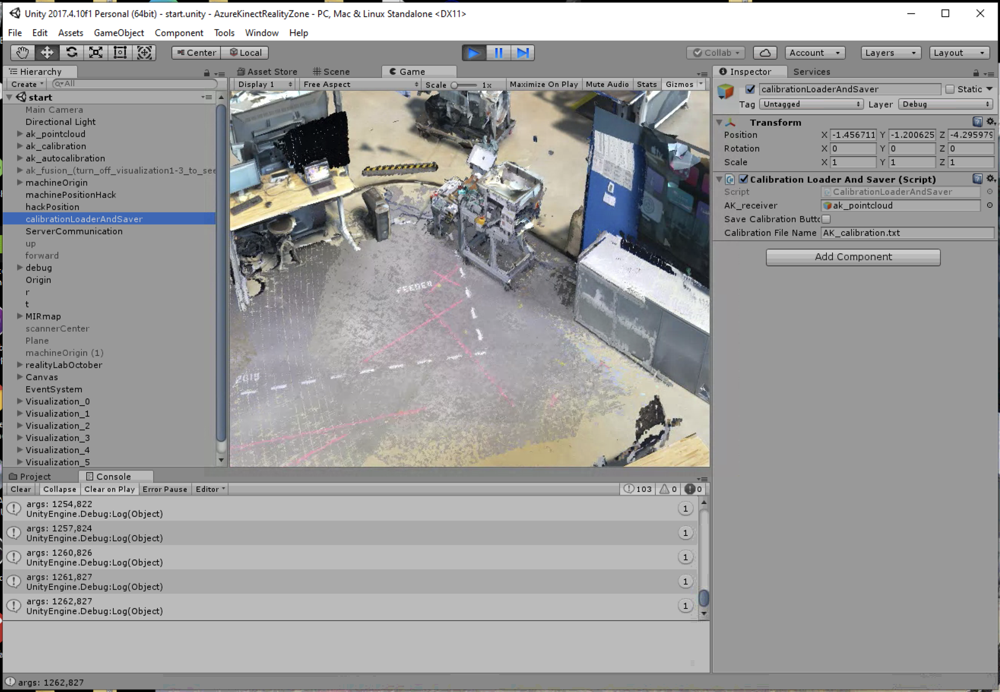
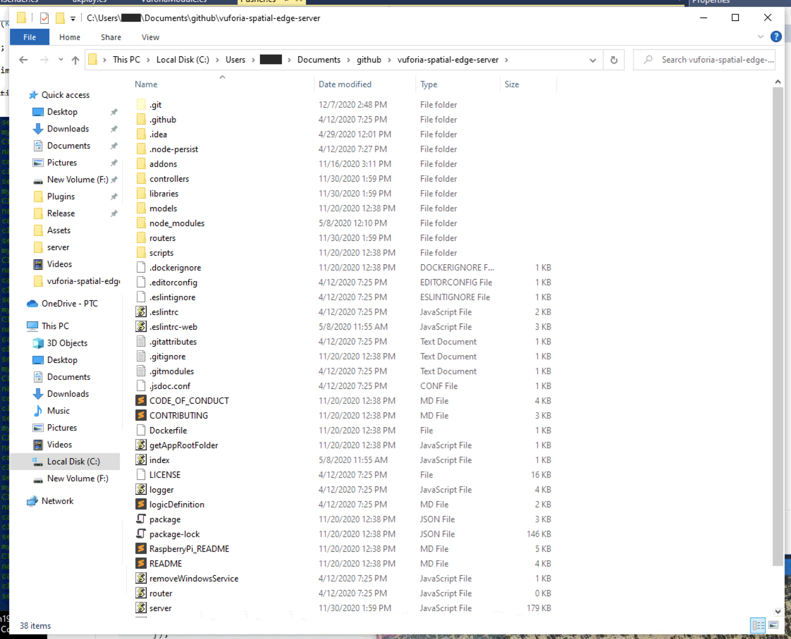
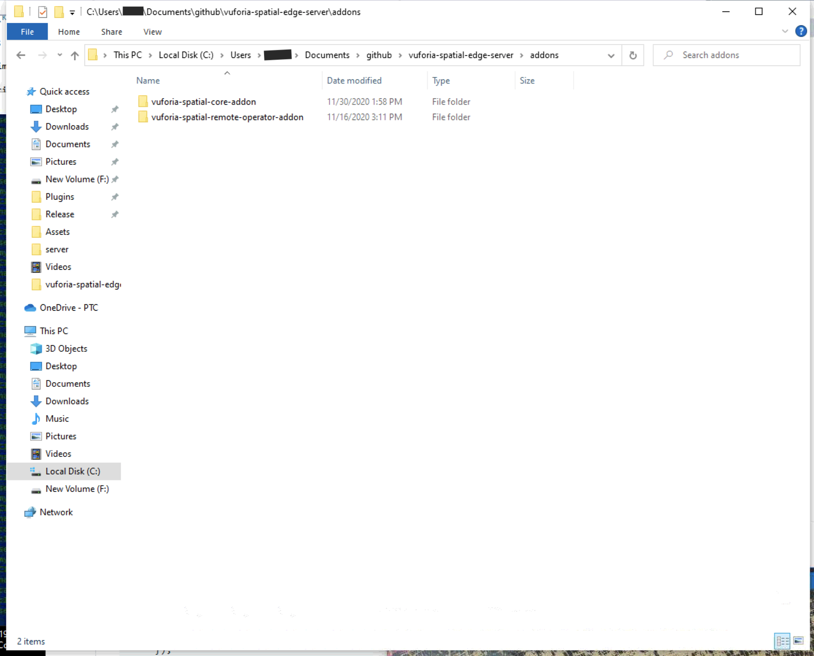
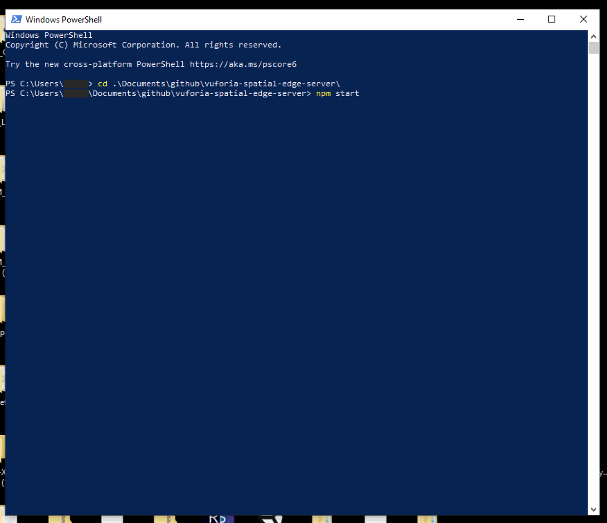
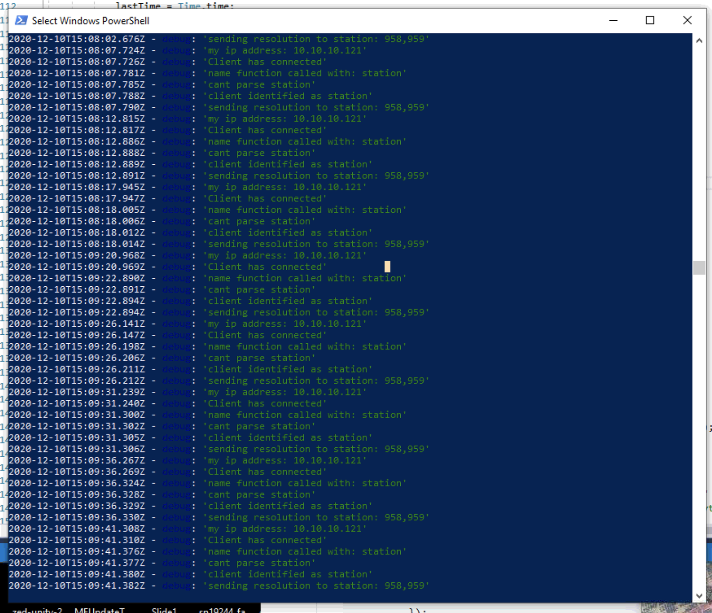
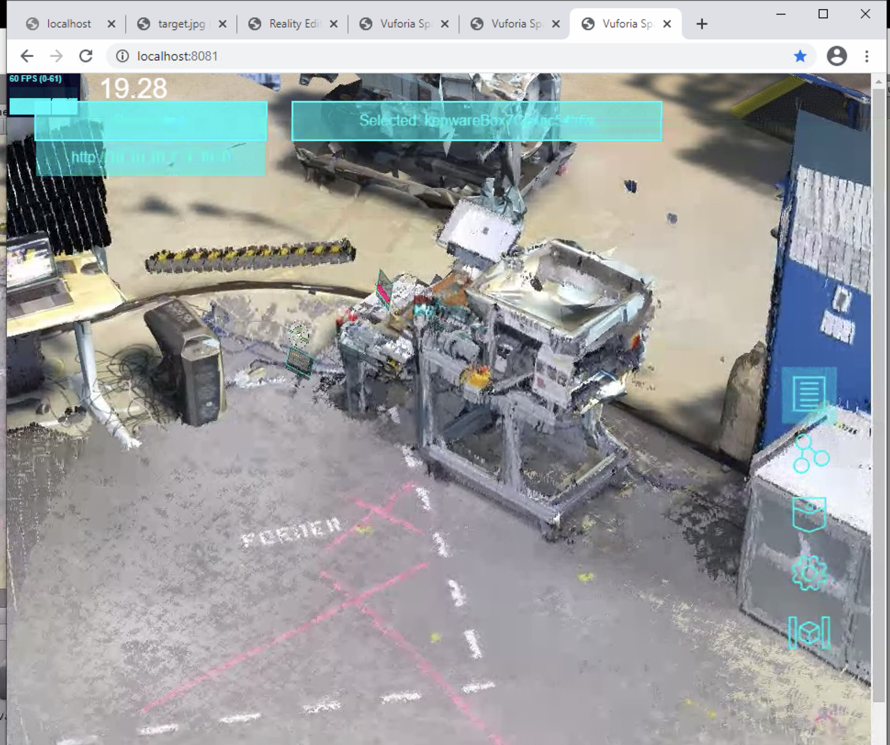

# Vuforia Spatial Toolbox Virtualizer

## Read First
The Vuforia Spatial Toolbox and Vuforia Spatial Edge Server make up a shared research platform for exploring spatial computing as a community. This research platform is not an out of the box production-ready enterprise solution. Please read the [MPL 2.0 license](LICENSE) before use.

Join the conversations in our [discourse
forum](https://forum.spatialtoolbox.vuforia.com) if you have questions, ideas,
want to collaborate, or to just say hi.


## Prerequisites

Note that you must own 1-6 Microsoft Azure Kinect cameras to use this software.

Install [Git](https://git-scm.com/downloads) and/or [Github
Desktop](https://desktop.github.com/). Install Unity 2017.4.10f1 from the
[Unity download archive](https://unity3d.com/get-unity/download/archive).
Install [Azure Kinect Development Kit
v1.3.0](https://docs.microsoft.com/en-us/azure/kinect-dk/sensor-sdk-download)
and [Azure Kinect Body Tracking SDK
v0.9.4](https://docs.microsoft.com/en-us/azure/kinect-dk/body-sdk-download)

If you encounter the error `DllNotFoundException` it will be necessary to also
install Visual Studio Code 2017 and 2019 with support for C++ development. This
covers missing dependencies on freshly installed copies of Windows.

## Copying dependencies with checkout.sh

Run this repository's script checkout.sh in Git Bash. This generally looks like
the following:

```bash
cd Documents/GitHub/repos/Virtualizer
./checkout.sh
```

This should copy some dlls from the Azure Kinect SDKs, you should have some new
dll files in the same directory as checkout.sh. The whole process should look
like this:



## Adding OpenCVForUnity

Next, it's time to add OpenCVForUnity v2.4.2 to the project. This project is
available [on its website](https://enoxsoftware.com/opencvforunity/). For
testing purposes the free trial is enough. Add this asset through Unity's
Assets > Import package > Custom package menu.

## Starting the project in Unity

Open the project in Unity. It should look like this:



If the start scene doesn't open by default, open it here:



Clicking the run button should pop up with uncalibrated cameras. To get an
initial calibration click the Autocalibrate button then manually refine the
camera positions if desired.



Click "Save Calibration" to save this new calibration.



## Connecting to an edge server

Download and setup the edge server as described in [the
tutorial](https://spatialtoolbox.vuforia.com/docs/use/connect-to-the-physical-world/install-on-windows).
You should have a working edge server with a normal directory structure:



Stop the server if it's been started.

Download the remote operator from [its
repository](https://github.com/ptcrealitylab/vuforia-spatial-remote-operator-addon/)
and unpack its directory
in your edge server's addon directory. It should look like this:



## Starting the edge server

Stop the Unity scene if it's currently running. Start the server with `npm start`:



With the server running and logging messages to the console, start the Unity
project. It should connect to the edge server. Note the 'name function has been
called with: station' messages below



## Viewing in browser

Finally, open [localhost:8081](http://localhost:8081) and select your local IP
from the top left menu to see the Virtualizer in action.


