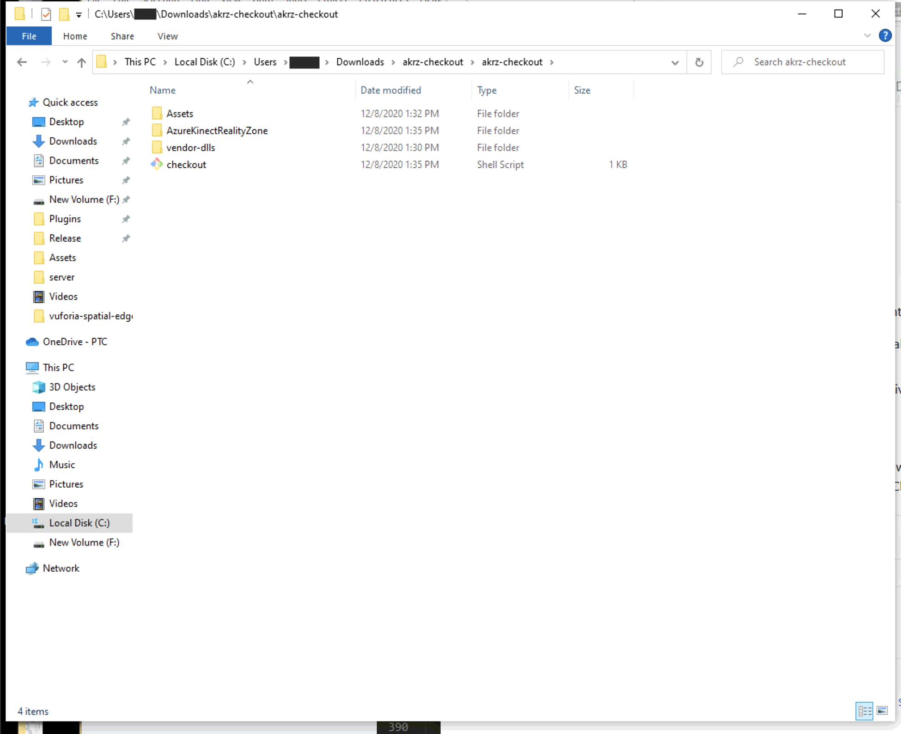
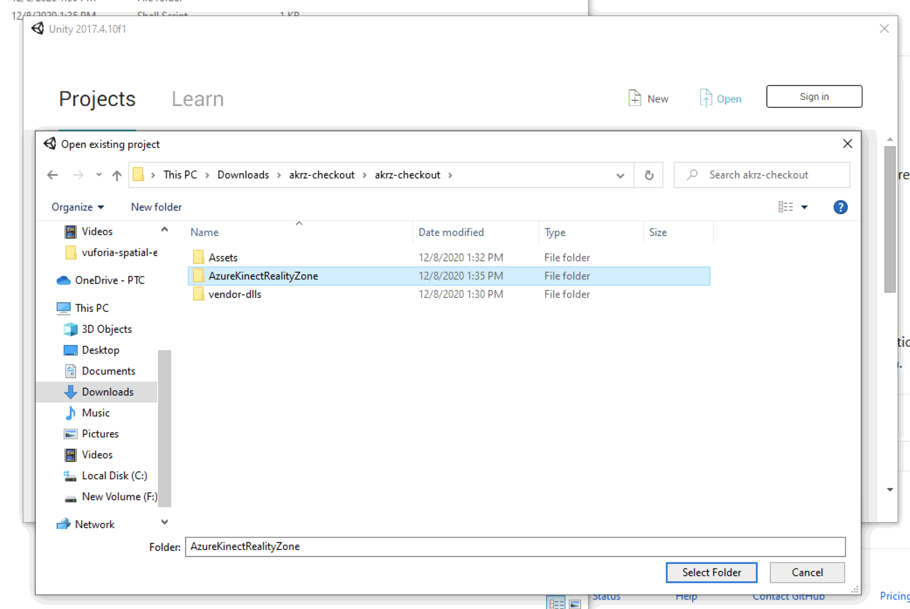

# Azure Kinect Reality Zone

## Installation prerequisites
Install [Git](https://git-scm.com/downloads) and/or [Github
Desktop](https://desktop.github.com/). Install Unity 2017.4.10f1 from the
[Unity download archive](https://unity3d.com/get-unity/download/archive).

## Downloading and setting up with akrz-checkout

Download the latest akrz-checkout.zip from the [Releases
page](https://github.com/ptcrealitylab/AzureKinectRealityZone/releases). Unpack
this zip in Documents or an equivalent directory.

Run checkout.sh in Git Bash. This generally looks like the following:

```bash
cd Documents/akrz-checkout
./checkout.sh
```

After a brief git clone and a less-brief copying of some vendored dependencies,
you should have the following directory layout.



## Starting the project in Unity

Open the project in Unity. It should look like this:



If the start scene doesn't open by default, open it here:


Clicking the run button should pop up with uncalibrated cameras. To get an
initial calibration click the Autocalibrate button then manually refine the
camera positions if desired.


Click "Save Calibration" to save this new
calibration.


## Connecting to an edge server

Download and setup the edge server as described in [the
tutorial](https://spatialtoolbox.vuforia.com/docs/use/connect-to-the-physical-world/install-on-windows).
You should have a working edge server with a normal directory structure:


Stop the server if it's been started.

Download the remote operator from [its
repository](https://github.com/ptcrealitylab/vuforia-spatial-remote-operator-addon/)
and unpack its directory
in your edge server's addon directory. It should look like this:


## Starting the edge server

Stop the Unity scene if it's currently running. Start the server with `npm start`:


With the server running and logging messages to the console, start the Unity
project. It should connect to the edge server. Note the 'name function has been
called with: station' messages below


## Viewing in browser

Finally, open [localhost:8081](http://localhost:8081) and select your local IP from the top left menu to see the Reality Zone in action.


